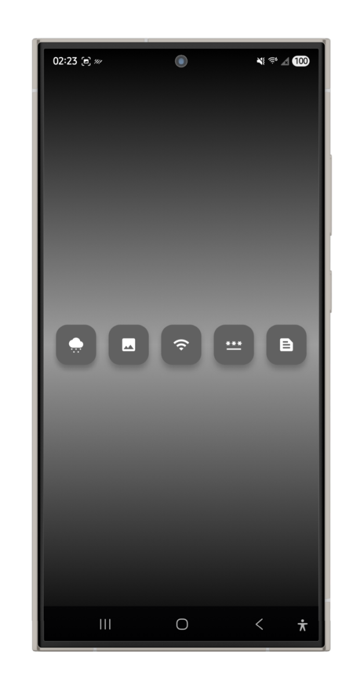

# E-Ink Display Controller

A Flutter app for controlling an E-Paper device, paired with a [FastAPI E-Ink Display Server](https://github.com/dazemc/ink_manager). Built with BLoC architecture, it enables users to display images, text, weather, quotes, and QR codes on an e-ink display (e.g., Raspberry Pi with Waveshare e-Paper).

## Features

- **Home**: Central dashboard for device status and navigation.
- **Image Upload**: Upload images to the server for display on the e-ink screen.
- **QR**: Generate and display QR codes for Wi-Fi credentials or SSH access.
- **Quote**: Fetch and show daily inspirational quotes via the ZenQuotes API.
- **Weather**: Display real-time weather forecasts using OpenWeatherMap API data.

## Screenshot

 
*Screenshot of the app’s main interface, showcasing the home dashboard and controls.*

## Tech Stack

- **Flutter**: Cross-platform mobile and web UI.
- **BLoC**: State management for reactive UI updates.
- **FastAPI Backend**: RESTful API for e-ink display control (see [E-Ink Display Server](https://github.com/dazemc/ink_manager)).
